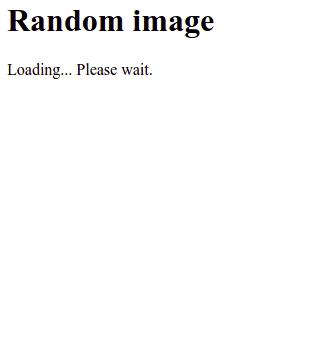

# vue-fallback

Vue Fallback is a simplistic alternative for the lack of the *Suspense* component in Vue.js 2.

<p align="center">
  
</p>

## Disclaimer

This is an experiment in a very early stage of development. Use it at your own risk.

## Installation

Add the package to your project dependencies:

```shell
npm install vue-fallback

# or

yarn add vue-fallback
```

Import it as a plugin to register the component globally:

```javascript
import Fallback from 'vue-fallback';
Vue.use(Fallback.plugin);

// or

import { plugin } from 'vue-fallback';
Vue.use(plugin);
```

Or, alternatively, import just the component to use it only where needed:

```javascript
import Fallback from 'vue-fallback';
Vue.component('fallback', Fallback.component);

// or

import { fallback } from 'vue-fallback';
Vue.component('fallback', fallback);
```

## Usage

```html
<fallback :state="state">
  <template #done>
    <button @click="restart">Restart!</button>
  </template>
  <template #pending>
    <p>Loading... Please wait.</p>
  </template>
</fallback>
```

The Fallback component has only one prop, the `state`, which is required and determines which slot will be shown according to its value (`pending`, `done` or `error`).

When no `#error` slot is given `#done` will be used regardless of the outcome.

## Known issues

Due to the use of a functional component to circumvent the single-root rule (to avoid an unwanted wrapper element), Vue.js devtools will show several nodes for a single instance. This is not a deal-breaker, it is just a little annoying.

## TODO

- [ ] Add tests
- [ ] Get usage feedback
